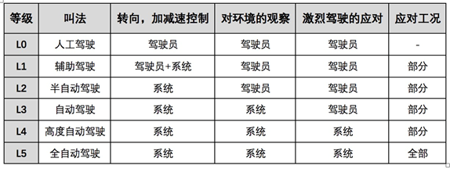
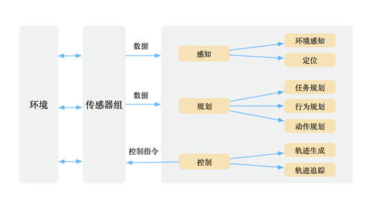

# 1. 初识无人驾驶系统

近两年来随着无人驾驶技术突飞猛进，各大整车企业、无人驾驶系统解决方案提供商（如百度阿波罗、景驰等）也在不断努力将无人驾驶技术向商业化落地推进。显然，无人驾驶技术已经不再是遥不可及的“未来技术”。无人驾驶技术范畴不仅仅包括车辆控制、路径规划、感知融合等领域，还包括人工智能、机器学习、深度学习、强化学习等前沿领域，无人驾驶在未来的5-10年里必将会掀起一场新的技术和市场革命。

站在工程应用的角度，学习和实践无人驾驶系统中的各种基本算法，是非常有必要的。本章为无人驾驶系统概述，主要介绍无人车以及无人驾驶系统的概念、无人驾驶技术的意义、无人驾驶技术的发展历程以及现代无人驾驶系统的体系结构。通过本书，读者会对当前流行的无人驾驶系统和算法体系等有一个清晰、完整的理解。

## 1.1 什么是无人驾驶

**无人驾驶汽车（Self-Driving Car）**也被称为无人车、自动驾驶汽车，是指能够依据自身对周围环境条件的感知、理解，自行进行车辆运动控制，且能达到人类驾驶员驾驶水平的车辆系统。

无人驾驶系统包含的技术范畴很广，是一门交叉学科，包含了多传感器融合技术、信号处理技术、通讯技术、人工智能技术，计算机技术等。若用一句话来概述无人驾驶系统技术，即是通过多种车载传感器（如相机、激光雷达、毫米波雷达、GPS、惯性传感器等）来识别汽车所处的周边环境和状态，并根据所获得的环境信息（包括道路信息、交通信息、车辆位置和障碍物信息等），自主做出分析和判断，从而自主地控制车辆运动，最终实现无人驾驶。

### 1.1.1 无人驾驶的分级标准

在车辆智能化的分级中，工业界目前有两套标准，一套是由美国交通部下属的国家高速路安全管理局（National Highway Traffic Safety Administration， NHSTA）制定的，另一套是由国际汽车工程师协会（Society of Automotive Engineers，SAE）制定的。两者的L0、L1、L2的分类都是相同的，不同之处在于NHTSA的L4被 SAE 细分为L4和L5。考虑到国内多采用SAE标准，本书采用SAE标准介绍。下图是SAE的分级标准：

其中L0级即完全由人类驾驶员驾驶车辆，L1又称为辅助驾驶，L2被称为半自动驾驶或者部分自动驾驶，这类系统已经具备了干预辅助类的ADAS功能。从L2到L3，无人驾驶系统的能力发生了本质的改变，L2及以下还是由人来监控驾驶环境，并且需要人来直接进行车辆控制；而L3级被称为自动驾驶，这个等级下的无人驾驶系统已经具备了综合干预辅助类功能，处于L3级的车辆系统已经能够依靠自身传感器来感知周围驾驶环境，但是监控任务仍然需要人类驾驶员来主导，在紧急情况下仍然需要人类驾驶员进行干预。L4我们称之为高度自动驾驶，是指在限定区域或限定环境下（如固定园区、封闭、半封闭高速公路等环境下），可以实现由车辆完全感知环境、并在紧急情况下进行自主干预，无需人类驾驶员进行任何干预动作。L5即全自动驾驶， L5不需要驾驶员，也不需要任何人来干预方向盘和油门、刹车等，也不局限于特定场景的驾驶，可以适应任意场景和环境下的自动驾驶。

目前大多数无人驾驶创业公司、整车厂等仍然处于L2到L4级别无人驾驶技术阶段，即无人驾驶原型车仅能够在特定的限制区域（如封闭或半封闭园区内，路况非常良好的部分高速路段等）测试，并且需要车上安全员随时进行介入，很多互联网公司（如百度、Waymo、Uber、景驰、小马等）均在测试和研发L4级别的无人驾驶系统。

### 1.1.2 无人驾驶到底有多难

在一些极端路况下，道路没有清晰的道路线，路人、自行车、三轮车、动物甚至是马车均为道路交通的参与者，这个例子看起来似乎比较极端，但是这种路况在发展中国家是普遍存在的，中国的城市公共道路设施（道路线，交通标识，红绿灯）虽然相对完善，但是在诸如乡村、县城等区域，交通的参与者种类也会很多而且情况复杂，每个个体的行为都难以预估。对于这类复杂的交通场景，任何一个训练有素的、清醒的人类驾驶员都能够轻松掌控这些问题并且顺利完成驾驶任务。但是对于无人驾驶系统而言，要处理这类场景就现阶段而言就非常困难了，这些复杂、变化多端的交通状况，是实现全自动驾驶之路的最大障碍之一。

无人驾驶难的第二个原因则是由人类的法规和制度带来的。道路交通在不同的国家和地区呈现出各种各样的状态，例如英国的驾驶习惯是左侧行驶，而中国的驾驶习惯是右侧行驶。并且，不同国家都有不同类型、符号的交通信号标志，其表示的含义也大为不同。这也就意味着，并不存在全球通用的无人驾驶系统，不同的国家不同的道路法规、习俗都不尽相同，因此，无人驾驶系统也需要做“本地化”，如果全球通用，那这个技术的成本、系统复杂性可谓是相当高了，也不现实。

第三个障碍则来源于人们对于机器的“高期望”。人类能够容忍自身犯错，但是对于机器犯错容忍度却极低，而在第一点提到的复杂多变的驾驶场景下，无人车难免会犯错，比如在光线条件非常差的情况下识别不出路人，或者高精度地图里没有包含刚刚施工完成（但确实已经通车）的路段等等，事实是当前的技术和算法（不论是机器人学科的理论还是人工智能方向的方法），都还远远无法满足大众对于无人车的高期望。

第四个障碍来源于无人车的成本。经过百余年的发展，汽车工业已经将传统汽车的成本压缩到了极致，人们只需要几万元就能获得一辆汽车以及各种配置。但是无人驾驶系统为汽车引入了一笔不小的额外成本，其中包括各种新的传感器设备，计算设备、软件研发成本等等，以目前在无人车的感知中应用最广泛的激光雷达为例，满足L4的激光雷达售价普遍在10万美元以上，仅仅这些传感器的硬件成本就已经远远超出了绝大多数车辆自身的价格了，而如何降低成本实现量产也是目前推动无人车商业化落地的一个重要研究课题。

当然，在无人驾驶技术的道路上障碍还有很多：例如：无人驾驶法规的急需完善，高昂的研发投入，安全性问题，复杂场景的感知，人工智能技术难题，量产规模等等。无人驾驶技术在当前而言仍然充满挑战，换句话说，我们在无人驾驶领域仍然还有大量的技术研究工作要做，对于希望进入无人驾驶领域的读者而言，仍然有巨大的可以有所作为的空间。

## 1.2 为什么需要无人驾驶

无人驾驶技术之所以能够带来社会变革，其根本原因在于高度的无人驾驶等级能够从根本上改变人们的出行方式和生活方式，使人们的出行、生活方式更加智能化。研究表明，无人驾驶技术能够提高道路交通安全，以及缓解城市交通拥堵问题，随着无人驾驶技术在各个领域的应用，还将催生出一批新的产业链，创造大量的就业机会。

- 提高道路交通安全。无人驾驶系统不会分心，人类坐在无人车上不管是发短信还是吃东西，都不会影响车辆行驶。无人车也不会因为乘客赶时间而超速驾驶，它会严格按照交通法规非常平顺合理的将乘客送达至目的地。无人车不会饮酒，也没有兴趣在公路上莽撞行驶、开斗气车等。种种研究都表明，高度的无人驾驶系统能够大大提高道路交通的安全性，减少道路交通事故的发生。
- 缓解城市交通拥堵。举个例子，在堵车的情况下，很多时候会因为他人加塞，导致道路更加拥堵，无人驾驶则不会莽撞加塞，而是依据一定规则、顺序依次排队通过，这就可以大大减轻拥堵的程度，提高人们的出行效率。无人驾驶汽车还可以根据实时路况自动调整路线，在最短的时间内安全地把乘客送到目的地。数据表明，美国的平均通勤时间为50分钟，待自动驾驶普及后，人们将能空闲出大量额外时间来处理其它事情，而不是无奈的被堵在路上。
- 提升出行效率。由于没有了驾驶员，出行服务运营成本也会相应节省一大笔人力成本，进而摊薄出行费用，这些都可以极大的提升车辆运营的效率，进而提升人们的出行效率，改变人们的出行方式和生活方式。
- 降低驾驶者的门槛。以往申请驾驶证时，有关部门对驾驶者的年龄、身体状况等方面会有较为严格的要求。例如，低龄、超龄人士就不允许申请驾驶证，而身体有残障的人士则要进行多方面的评估。而无人驾驶汽车的出现，则让汽车驾驶申请门槛大为降低，在完全自动驾驶阶段，甚至无需申请，这对驾驶技术不过关、倒车技术不过关的人来说是个福音。无人驾驶汽车不论是对交通管理部门的影响还是对汽车驾驶者的影响，其意义都是巨大的。

## 1.3 无人驾驶系统基本框架

无人驾驶系统的核心可以概述为三个部分：**感知（Perception），规划（Planning）**和**控制（Control）**，这三部分的交互以及其与车辆传感器硬件、环境的交互如下图表示：

感知是指无人驾驶系统从环境中收集信息并从中提取相关知识的能力。其中，**环境感知（Environmental Perception**）特指对于环境的场景理解能力，例如障碍物的类型、道路标志及标线、行人车辆的检测、交通信号等数据的语义分类。**定位（Localization）**是对感知结果的后处理，通过定位功能从而帮助无人车了解其相对于所处环境的位置。

规划是指无人车为了到达某一目的地而做出决策和计划的过程。对于无人驾驶车辆而言，这个过程通常包括从起始地到达目的地，同时要避免障碍物，并且不断优化行车路线轨迹和行为，以保证乘车的安全舒适。规划层通常又被细分为**任务规划（Mission Planning）**，**行为规划（Behavioral Planning）**和**动作规划（Motion Planning）**三层。

控制是指无人车精准地执行规划好的动作、路线的能力，及时地给予车辆执行机构合适的油门、方向、刹车信号等，以保障无人车能按预期行驶。

## 1.4 开发环境配置

本教程所使用的代码，推荐系统为Ubuntu-16.04，其本身本身包含Python 2.7环境。此外，我们要安装的ROS版本为Kinetic，OpenCV。这些工具的安装过程本文不再赘述，读者可参考官方网站和文档。

## 1.5 ROS入门

ROS(Robot Operating System)是目前最广泛使用的一种开源机器人软件平台，它的诞生极大的提升了机器人系统开发的效率。目前，部分无人驾驶系统的软件实现仍然依赖于ROS平台。对于高速自动驾驶开发，ROS的实时性略显不足，但由于ROS具有强大的系统底层通信功能，以及来自世界各地的优秀工程师在共同维护，在无人驾驶底层系统的实现上，ROS仍然是开源框架中最好的选择，诸如百度Apollo，Autoware，Udacity等无人驾驶车辆原型都是基于ROS开发的。百度Apollo即是在ROS平台的基础上，增加了实时性的framework，以满足高速自动驾驶实时控制的需求。

关于ROS的入门教程，读者可参考ROS官方入门教程。