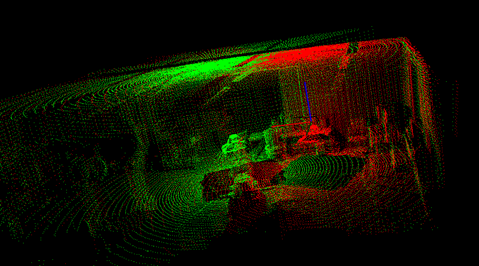
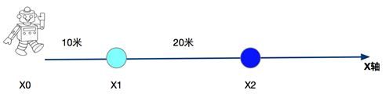

# 2. 相关技术原理

无人驾驶作为一个综合学科，涉及的技术原理诸多。本章重点介绍定位方法、状态估计和传感器融合。

## 2.1 定位方法

在无人车感知层面，定位的重要性不言而喻，无人车需要知道自己相对于外界环境的精确位置。在城市复杂道路行驶场景下，定位位置的精度要求误差不超过10cm，如果定位位置偏差过大，那么在城市道路行驶中，车辆轮胎就很容易在行驶过程中擦到路牙，剐蹭到护栏等，还会引发爆胎等车辆驾驶安全问题，严重的甚至会引发交通安全事故。尽管在车辆自动驾驶中，会利用自动避障功能以辅助安全，但也不能保证百分百的避障成功，并且对于路牙这种道路障碍特征，在某些情况下，由于盲区、软件故障等原因，传感器也不一定能保证百分百检测到。因此，在无人车技术的发展过程中，定位精度的提高，无论是从硬件层面还是软件层面，都具有很重要的意义。

目前使用最广泛的无人车定位方法包括融合**全球定位系统（Global Positioning System，GPS**）和**惯性导航系统（Inertial Navigation System，INS）**定位方法，其中，GPS的定位精度视器件成本，一般在几十米到几厘米级别之间，精度越高，GPS和惯性导航等传感器的价格也就相对越昂贵。融合GPS/INS的定位方法在GPS信号缺失、微弱的情况下，如地下停车场，密集高楼的市区等场景，也不容易做到高精度定位，因此也只能适用于部分场景（例如开阔、信号良好环境下）的无人驾驶定位任务。

地图辅助类定位算法是另一类广泛使用的无人车定位算法，即**同步定位与地图构建（Simultaneous Localization And Mapping）**，**SLAM**是这类算法的代表，SLAM的目标即构建地图的同时使用该地图进行定位，SLAM通过利用传感器（包括视觉、激光雷达等）已经观测到的环境特征，确定当前车辆的位置以及当前观测目标的位置，这是一个利用以往的先验概率分布和当前的观测值来估计当前位置的过程，我们通常使用的方法包括：**贝叶斯滤波器（Bayesian Filter）**，**卡尔曼滤波（Kalman Filter）**，**扩展卡尔曼滤波（Extended Kalman Filter）**以及**粒子滤波（Particle Filter）**等，这些方法都是基于概率和统计原理的定位技术。

SLAM是机器人定位领域的研究热点，在特定场景下的低速自动驾驶定位的应用过程中，也有较多现实的实例，如园区无人摆渡车、无人清洁扫地车、甚至是扫地机器人、[Boston Dynamics制造的机械大狗](https://www.youtube.com/watch?v=PHnBYqH12Ko)等场景，都广泛使用了SLAM技术。实际上，在此类特殊场景的应用中，我们并不是在定位的同时实时建图，而是事先使用传感器如激光雷达、视觉摄像头等对运行环境区域进行了SLAM地图的构建，然后在构建好的SLAM地图的基础上去做定位、路径规划等其它进一步操作。

在有了一部分点云地图之后，还可以通过程序和人工处理的方法，将一些“语义”元素添加到地图中（例如车道线的标注，交通信号标志标线，红绿灯位置，当前路段的交通规则等等），这个包含了语义元素的地图就是我们无人驾驶领域常说的高精度地图（HD Map）。在实际定位的时候，使用3D激光雷达的扫描数据和事先构建的高精度地图进行点云匹配，确定无人车在地图中的具体位置，这类方法被统称为**扫描匹配方法（Scan Matching）**，扫描匹配方法最常见的方法是**迭代最近点法（Iterative Closest Point，ICP）**，该方法基于当前扫描和目标扫描的距离度量来完成点云配准。除此以外，**正态分布变换（Normal Distributions Transform，NDT）**也是进行点云配准的常用方法，它是基于点云特征直方图来实现配准的一种算法。基于点云配准的定位方法也能实现十厘米以内的定位精度，本书后文将会讲解基于正态分布变换的点云定位方法。

虽然点云配准能够给出较高精度的无人车相对于地图的全局定位，但是这类方法过于依赖事先构建好的高精度地图。另外，由于高精地图构建成本较高，并且点云匹配计算开销也非常大（例如Velodyne-32c每秒产生高达120万个点数据），车辆在高速行驶的过程中对计算、控制实时性要求较高，因此，在高速行驶无人驾驶场景，使用点云匹配的方法相对来说成本过高。

### 2.1.1 实现定位的原理

SLAM即时定位与地图构建（simultaneous localization and mapping, SLAM），也称为CML (Concurrent Mapping and Localization)，即并发建图与定位。SLAM方法可以描述为: 机器人在未知环境中从一个未知位置开始移动，在移动过程中根据位置估计和地图进行自身定位，同时在自身定位的基础上构建增量式地图，实现机器人的自主定位和导航。SLAM在扫地机器人，VR游戏等产品应用中有很多不错的成果。 

基于高精度点云地图的定位，即利用激光雷达产生的数据， 然后经过PCL（Point cloud library，点云库）转化为点云地图，通过点云间的匹配来完成定位的技术。

如果我们想要知道无人车的位置，只需要将Lidar当前扫描出的点云片段和我们的之前采集好的全局点云地图进行迭代匹配。在给出两组点云的情况下，假设场景不变，计算出这两组点云之间的pose。使用Iterative Closest Point (ICP)就可以让第一组点云的每个点在第二组点云里找到一个最近的匹配，之后通过所有的匹配来计算均方差（MSE，统计概念），匹配的过程实际上就是寻找最小均方差的过程。方差有可能来自测量误差，也有可能是场景的动态变化导致的。通过最小化误差，来计算无人车与当前地图环境最匹配的位置坐标。

### 2.1.2 迭代最近点算法（Iterative Closest Point, ICP）

目前三维配准中最常用的迭代算法就是ICP迭代算法，这种算法需要提供一个较好的初值，同时由于算法本身缺陷，最终迭代结果可能会陷入局部最优，而不是全局最优。

ICP算法原理：给定参考点集P和数据点集Q（在给定初始估计RT时），对Q中的每一个点寻找P中的对应最近点，构成匹配点对，全部匹配点对的欧氏距离之和作为误差目标函数error的值，利用SVD(奇异值分解)分解求出R和T，使得error最小，将Q按照R和T做旋转变化，并以此为基准回到1 重新寻找对应点对。

**缺点**：要剔除噪声点（点对距离过大或者包含边界点的点对）；基于点对的配准没有包含局部形状的信息；每次迭代都要搜索最近点，耗时大；可能陷入局部最优。

### 2.1.3 正态分布变换（Normal Distribution Transform, NDT）

正态分布变换（NDT）算法是基于标准正态分布的配准算法，它应用于三维点的统计模型，使用标准最优化技术来确定两个点云间的最优匹配，因为其在配准过程中不利用对应点的特征计算和匹配，所以计算速度比其他方法快。

这个算法耗时相对稳定，与给定的初值关系不大，初值误差大时，也能很好的纠正过来。计算正态分布是在初始化时进行的一次性工作，不需要消耗大量代价计算最近邻搜索匹配点，概率密度函数在两幅图像采集的间隔可以离线计算出来。

- **NDT算法**：基本思想是先根据参考数据来构建多维变量的正态分布，如果变换参数能使得两幅激光数据匹配的很好，那么变换点在参考系中的概率密度将会很大。因此，可以考虑用优化的方法求出使得概率密度之和最大的变换参数，此时两幅激光点云数据匹配的最好。其基本步骤为（1） 将参考点云网格化，并计算每个网格的多维正态分布参数；（2）初始化变换参数和求最大似然；（3）优化参数。这种通过一个个网格分出来的光滑表面的表示是连续可导的，每一个概率密度函数可以被认为是一个局部表面的近似。

### 2.1.4 基于GPS+惯性组合导航的定位系统

惯性组合导航系统（INS，Inertial Navigation System，简称惯导）是一种基于陀螺仪和加速度计的信号组合的自主式导航系统。它可以运行在水、陆、空等多种环境中。惯导的基本工作原理是以牛顿力学定律为基础，通过测量载体在惯性参考系的加速度和角速度信息，再将这些测量值对时间进行积分，把它变换到导航坐标系中，最后得到导航坐标系中的速度v、偏航角yaw和位置x/y等信息。一般情况下会结合GPS使用，并融合经纬度信息，以提供更精确的位置信息。

其具有以下优点：

- 由于它不依赖于任何外部信息，也不向外部辐射能量，故隐蔽性好，也不受外界电磁干扰的影响；

- 可全天候、全时间地工作于空中、地球表面乃至水下；
- 能提供位置、速度、航向和姿态角数据，所产生的导航信息连续性好而且噪声低；
- 数据更新率高、短期精度和稳定性好。

其缺点是：

- 由于导航信息经过积分而产生，定位误差随时间增加而增大，长期精度差，容易产生温漂、零漂等问题；
- 每次使用之前需要较长的初始对准时间；
- 设备的价格较昂贵；

GNSS（Global Navigation Satellite System，全球卫星导航系统）导航是基于GPS信号的导航系统，在无人车定位系统中也是必不可少的。普通GNSS设备在Standard Positioning Service (SPS标准定位服务)定位模式下，一般可达到10m以内定位精度。由于天气原因，电离层，云层、太阳活动的变化，所以定位精度可能会在一定范围内波动。在城市环境下，特别是人口密集的超大城市、高楼密集环境下，定位精度可达10~100m区间；除了上述SPS标准定位服务外，还有PPS（Precise Positioning Service）精确定位服务，这种服务主要是面向军用服务。以及SBAS（Satellite-based augmentation systems，星基增强系统），是采用卫星作为基准参考站。以及GBAS(Ground-Based Augmentation System，地基增强系统)，是采用地面基站作为基准参考站。以及DGPS（Differential Global Positioning System，差分GPS），采用基准站的差分修正来提高定位精度。

### 2.1.5 基于Slam的定位系统

实时定位与地图构建（Simultaneous Localization And Mapping, SLAM）是一个很复杂的系统层次的概念，并不是特指一个具体的算法。它包括图像匹配处理模块、滤波处理、闭环检测、图优化理论、矩阵运算等等，是复杂的系统工程，本文只针对SLAM的基本原理和应用做初步的简介。

SLAM主要适用于机器人等领域，通过激光或视觉摄像头扫描环境数据点构建地图，然后基于地图匹配的方式进行自身定位。在诸如无人清洁车，低速园区无人摆渡车，低速无人快递车等低速场景的自动驾驶应用中十分常见。对于高速自动驾驶，由于SLAM基于网格（Grid）进行计算，其庞大的计算开销、时延、数据存储等问题，以及无人车对实时控制、安全的高性能要求，导致其目前并不适宜应用在大面积范围、高速自动驾驶场景中。高速自动驾驶在地图定位方面使用的是高精地图技术（HD Map）。

SLAM定位的基本原理：通常情况下，机器人因为移动的不确定性而导致有漂移问题，一个好的SLAM系统，不仅能处理环境的不确定性，还能处理机器人自身轨迹的不确定性。

如上图所示，假设一个机器人运动本体从原点X0（0,0）沿X轴方向向前移动10m，那么理论上，它的位置应该是（10,0）。但工程实际上，由于测量设备的不准确性，诸如陀螺仪测量值不准、轮子打滑、测量设备零漂等原因，使得机器人并不能准确到达（10,0）位置。机器人到达的位置，有可能是（9.8,0），也有可能是（10.1,0），这是由于运动本体的运动的不精确性导致的。实际上，从数学理论来说，X1的位置变量符合一个以（10,0）为中心的高斯分布，方差δ可能是0.1或0.2。如果机器人继续往前走，不纠正的话，误差会越来越大，直至系统失效。

我们希望在给定初始值x0的位置为（0,0）时，让x1的位置尽可能准确。其实就是计算怎样最大化x1位置的似然估计。通过引进新的参考物，可以增加参考位置的可靠性。打个比方，就像一个人在荒无人烟的沙漠中行走，如果有一棵大树作为参照物，他就能知道自己现在在哪，走了多远。这个参照物也就是我们常说的landmark。通过不断观察landmark，并实时更新当前位置，从而校正当前位置误差。但是，随着路标位置的丢失，定位的误差又会慢慢变大，因此，我们需要通过不断迭代对新的landmark的观测值，来最大化当前位置的似然估计。

下面我们简单介绍一下各个SLAM的优缺点，从而让读者能更深入的了解目前SLAM系统的情况。

- 单目SLAM的优缺点：单目SLAM的优点是只需要一个摄像头即可，而且不用考虑双目摄像头在长时间使用或碰撞情况下造成的标定参数误差变大问题。缺点就是尺度不确定，即无法测量深度。

- 双目SLAM的优缺点：双目SLAM的优点是比较容易获得场景深度信息，不用考虑单目尺度不确定性的问题。缺点是对设备体积的有要求，并且两个摄像头之间必须有基线校正。

- RGBD-VSLAM优缺点：RGBD-VSLAM的优点是可直接获得场景深度信息，在线工作时，减少了相应的深度计算工作，即减少了计算工作量。RGBD深度相机也被认为是未来VSLAM最有前途的视觉传感器。缺点：相对成本略高

- 直接法和特征点法的优缺点：特征点法的优点：基于特性点法的VSLAM对快速运动的鲁棒性要比直接法高。特征点法的缺点：由于角点检测、描述、匹配耗时较长，因此实时性比直接法差。直接法的优点：处理速度快，因为特征往往是梯度点、边，提取简单，所以描述匹配简单，建图特征比特征点法要稠密。直接法的缺点：对于快速运动的鲁棒性不足，只适合短基线的匹配。因为在优化迭代位姿时，相机运动过快会容易导致相邻帧基线过长，从而导致相邻帧像素偏差过大，导致位姿求解陷入一个错误的局部最优解。

## 2.2 状态估计和传感器融合

### 2.2.1 卡尔曼滤波和状态估计

在物体跟踪、预测类的应用中，通常需要对一些感兴趣的目标状态去做状态估计预测。为什么要做估计预测呢？因为在实际场景中通常需要持续观测、预测到目标的运动和发展情况，以对当前状态采取更适合的决策。为了估计一个目标的状态，例如距离，最直接的方式是用传感器测量，但是由于测量的误差和噪声存在，又不能完全相信测量值，这个时候就可以采用概率学和统计学的方法，去分析统计和估计状态量。卡尔曼滤波就是这样一种结合预测（先验分布）和测量更新（似然估计）的状态估计算法。

- 扩展卡尔曼滤波【TO DO：完善技术细节】
- 无损卡尔曼滤波【TO DO：完善技术细节】

为了更好地进行状态估计，首先从卡尔曼滤波算法出发，然后讨论了用于处理非线性系统的扩展卡尔曼滤波，最后讨论了无损卡尔曼滤波。在无人车（机器人）系统中，卡尔曼滤波这类贝叶斯滤波器有着广泛的应用，不仅仅局限于目标的状态估计，在多传感器融合、定位、SLAM等领域，也有着非常广泛的应用，掌握并熟练运用卡尔曼滤波算法在无人驾驶系统的工程应用中非常重要。

