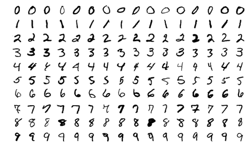
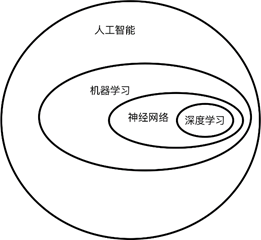
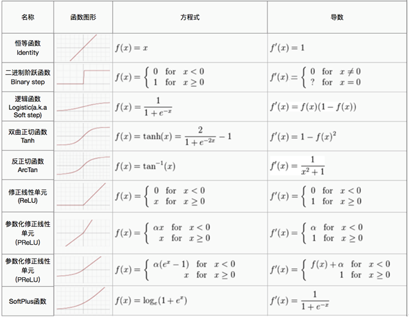

# 3. 机器学习和神经网络基础

环境感知，是目前无人驾驶系统中最大的挑战之一，在无人车的环境感知环节中，除了需要知道车辆环境中的障碍物以外，还需要明确障碍物是什么？行人和车辆虽然都可以理解为障碍物，但它们并不是一般的障碍物，因此它们的行为，运动模型等也不相同，为了让无人车的驾驶行为更接近于人类驾驶员，需要对目标障碍物进行识别，这个识别的过程是典型的**模式识别（Pattern Recognition）**过程。虽然基于激光雷达的点云数据可以做到目标的点云聚类，同时也有一些算法支持点云上的模式识别[8]，但无论是广泛使用的64线激光雷达还是即将问世的128线激光雷达，点云数据的解析度仍然太低。在某些情况下，即使是人类也无法基于目标的点云去判断目标“为何物”，相比之下，图像的解析度要高得多，图像包含的信息足以进行模式识别，所以本书主要探讨基于图像的模式识别。

那么到底什么是模式识别呢？模式识别，简单来说，就是通过计算机模型识别模式种类的过程。这个“模式”是指我们研究的环境和客体。对人类来说，特别重要的是对光学信息（通过视觉器官来获得）和声学信息（通过听觉器官来获得）的识别，这是模式识别的两个重要方面。市场上可见到的代表性产品有光学字符识别（OCR）、语音识别系统。在无人驾驶感知领域，尤其是视觉感知领域，主要以图像和激光雷达点云的检测和识别为主。

传统的计算机视觉=往往需要人为地设计特征，这些特征对于不同的任务来说是不同的，例如车道线检测和行人检测需要分别设计特征；另一方面，人为地设计特征往往会存在疏漏，对于安全性要求极高的无人驾驶汽车来说，忽视某些细节问题的软件程序设计必定存在缺陷，从而可能会造成严重的安全后果。

## 3.1 基本概念

机器学习是无人驾驶技术体系中极其重要的一环，其中的深度学习更是近年来研究的热点。掌握机器学习的基本理论，是进行端到端无人驾驶，强化学习控制，基于深度学习的环境感知等研究的第一步。

**机器学习（Machine learning）是一类基于数据或者既往的经验，优化计算机程序的性能标准的方法**。机器学习，就是能够从经验中不断“学习进步“的算法，在很多情况下，我们将这些经验用数值描述，因此，经验=数据 ，这些收集在一起的数据被称为**数据集（Dataset）** ，以手写字识别模型为例，手写字数据被称为MNIST数据集（Modified National Institute of Standards and Technology database），每一条数据被称为一个样本，在这些已有的数据集上学习的过程称之为**训练（Train）** ，因此，这个数据集又被成为**训练集（Training Set）** ，很显然，我们不仅关心机器学习算法在训练集上的表现，并且希望算法对从未见过的手写数字也能够正确的识别，这种在新的样本（数据）上的性能被称之为 **泛化能力（Generalization Ability）**，对于一个任务而言，泛化能力越强，这个机器学习算法就越成功。

根据数据集的不同，机器学习可以分成如下三类：

 **监督学习（Supervised Learning）：**数据集既包含样本（手写字图片），还包含其对应的标签（每张手写字图片对应的是哪个数字）

**无监督学习（Unsupervised Learning）：**与监督学习相对应，数据集仅包含样本，不包含样本对应的标签，机器学习算法需要自行确定样本的类别归属

 **强化学习（Reinforcement Learning）：**又称为增强学习，是一种半监督学习，强调如何基于环境而行动，以取得最大化的预期利益。我们在后面的章节中会重点介绍。

当前大热的神经网络，深度学习等都是监督学习，随着大数据时代的到来以及GPU带来的计算能力的提升，监督学习已经在诸如图像识别、目标检测和跟踪、机器翻译、语音识别和自然语言处理的大量领域取得了突破性的进展。然而，当前在无监督学习领域并没有取得像监督学习那样的突破性进展。

## 3.2 监督学习

监督学习是机器学习中的一类方法，也是目前应用最广泛的机器学习方法。

### 3.2.1 经验风险最小化

假定存在一个**损失函数(Loss function)** L，以损失函数为基础，我们定义 **风险**： 函数的风险，就是损失函数的期望值。真实的风险是建立在对整个样本空间进行考虑的基础之上的，我们并不能获得整个样本空间，有的只是一个从我们要解决的任务的样本空间中使用独立同分布的方法随机采样得到的子集（也就是我们的数据集）。在这个子集上，我们可以求出这个真实分布的**近似值**，比如说**经验风险(Empirical Risk)**。我们选择能够最小化经验风险的函数 ，这样的一个策略就被称之为**经验风险最小化原则**。很显然，当训练数据集足够大的时候，经验风险最小化这一策略能够保证很好的学习效果——这也就是深度神经网络取得成功的一个重要原因。专业的说，我们把已有的数据集的大小称为**样本容量（Sample Size）**。不论什么应用领域，规范大数据集合，就意味着机器学习任务已经成功了一半。

### 3.2.2 模型，过拟合和欠拟合

在学习目标函数的过程中需要一个**载体**, 这个载体的作用就是用来表述各种各样的函数   ，这样我们就可以通过调整这个载体去选择一个最优的函数   ，这个最优的函数   能够使经验风险最小化，这个载体，就是机器学习中的**模型（Model）**。

以**人工神经网络（Artificial Neural Network，ANN**）为例，它也被简称为**神经网络（Neural Network，缩写NN）**或类神经网络，在机器学习和认知科学领域，是一种模仿生物神经网络（动物的中枢神经系统，特别是大脑）的结构和功能的数学模型或计算模型。神经网络由大量的人工神经元组成，并且能在外界信息的刺激下改变内部结构，是一种自适应系统。下图是一个神经网络模型结构：

我们把这个模型理解成一个黑箱，这个黑箱里有很多**参数（Parameter）**，我们用W来描述这个黑箱中的参数，这些参数被称为**模型参数**，即使模型内部的结构不变，仅仅修改这些参数，模型也能表现出不同的**功能**（描述不同的函数的能力）。具体来说：对于手写字识别任务，我们在手写字数据集上通过经验风险最小化策略调整神经网络的模型参数，使得神经网络拟合出一个函数，那么我们训练出来的这个“黑箱”就可以用于手写字识别了;而对于车辆识别来说，同样利用经验风险最小化策略，我们可以训练出一个黑箱（神经网络）来做车辆识别。

通过前文机器学习的概念我们知道，衡量一个机器学习模型的关键在于其泛化能力，一个衡量泛化能力的重要指标就是模型的**训练误差**和**测试误差**的情况：

- **训练误差：**模型在训练集上的误差

- **测试误差：**模型在从未“见过的”测试集上的误差

这两个误差，分别对应了机器学习任务中需要解决的两个问题： **欠拟合（Underfitting）**和**过拟合（Overfitting）**。当训练误差过高时，**模型学到的函数并没有满足经验风险最小化**。具体地，如果模型在训练集中的识别精度也很差，我们称这种情况为欠拟合。当训练误差低但是测试误差高，即训练误差和测试误差的差距过大时，我们称之为过拟合，此时模型学到了训练集上的一些“多余的规律”，表现为在训练数据集上识别精度很高，在测试数据集（未被用于训练，或者说未被用于调整模型参数的数据集合）上识别精度不高。

模型的**容量（Model Capacity）**决定了模型是否倾向于过拟合还是欠拟合。模型的容量指的是模型拟合各种函数的能力，一般而言，越复杂的模型能够表述越复杂的函数（或者说规律，或者说模式）。那么对于一个特定的任务（比如说手写字识别），如何去选择合适的模型容量来拟合相应的函数呢？根据**奥卡姆剃刀原则(Occam's Razor)**：在同样能够解释已知观测现象的假设中，我们应该挑选“最简单”的那一个。

### 3.2.3 梯度下降算法

前面我们说到可以通过“一定的算法”调整神经网络的参数，这里我们就来介绍这个定向（朝着经验风险最小化的方向）调整模型参数的算法——梯度下降算法 (Gradient Descent Algorithm)。

梯度下降算法是一个一阶最优化算法，通常也称为最速下降法。 要使用梯度下降法找到一个函数的局部极小值，必须向函数当前点对应梯度（或者是近似梯度）的反方向的一定距离内进行迭代搜索。这种通过向导数的反方向移动一小步来最小化目标函数（损失函数）的方法，就是梯度下降算法。神经网络这种复杂的模型包含了很多参数，导数就变成了包含所有参数的偏导数的向量。其中的变化量就可以理解为我们进行梯度下降的过程中更新一步梯度的步长，通常，步长被称为**学习率（Learning Rate）**, 它描述了梯度下降的速度。

## 3.2 神经网络基础

在上一节中，我们介绍了机器学习的相关基础，尤其是知道了监督学习的基本构成因素：数据、模型、策略和算法。在本节，我们将具体学习一种监督学习算法——神经网络。深度学习模型多为深层人工神经网络，所以在进一步探索深度学习在无人驾驶中的应用之前，我们先了解一下神经网络的理论基础和代码实现。

既然说到神经网络和深度学习，先来看看各种概念的关系和范畴，如下图所示：

人工智能是一个很大的概念范畴，机器学习是人们在探索人工智能的过程中的一类方法，神经网络是机器学习中的一类监督学习算法，而深度学习则是将神经网络的层数增多，使用大量数据来建立的一种表示学习算法（关于表示学习，我们会在深度学习一节详细论述）。

我们以上一节介绍的监督学习的几个因素（模型、策略和算法）来逐一介绍神经网络算法中的这几个因素，任务我们还是沿用上一节介绍的手写数字识别任务，实验的数据集仍然是MNIST数据集。

### 3.2.1 激活函数

最初的神经网络的设计借鉴的是生物神经元的结构，我们使用一个数学模型来描述人类的神经元的结构以及接受刺激，被激活然后传递刺激的过程，这一数学模型被称为**感知机（Perceptron）**。阶跃函数是一个非线性变换，它属于**激活函数** **(activation function)**的一种，由于阶跃对函数的模拟比较粗糙，所以通常不会使用阶跃函数作为神经元的激活函数，常用的激活函数包括：sigmoid 函数， tanh 函数， ReLU (rectified linear unit)及其变体等，具体的激活函数表达式可参考下图：

### 3.2.2 前向传播

在求得损失以后，也就得到了神经网络的输出结果（对于手写字识别而言，就是识别的结果）以及输出结果与真实值之间的“距离”。我们把这么一个过程称为一次**前向传播（Forward Propagation）** ，显然，前向传播能够输出正确的分类的前提是神经网络已经具有了合适的参数，那么如何调整合适的参数呢？神经网络通过**反向传播（Back Propagation）**算法让损失函数的信息通过网络向前流动，从而计算梯度并更新权重。一次反向传播仅仅只更新了一次参数（可以理解为梯度下降过程中的一步），称为一个Epoch，通常需要迭代多个Epoch才会使得网络收敛到合适的模型。

### 3.2.3 随机梯度下降

随机梯度下降**（Stochastic Gradient Descent，SGD）**是几乎所有的深度学习模型都采用的一种学习算法，在深度学习中，好的模型往往需要大量的数据，大量的数据带来的计算量也是巨大的。随机梯度下降是在大规模数据上训练大型线性模型的主要方法。在深度学习兴起之前,学习非线性模型的主要方法是结合核技巧的线性模型。当数据集的样本数巨大时，这类方法的计算量是不能接受的。在学术界，深度学习从 2006 年开始受到关注的原因是，在数以万计样本的中等规模数据集上，深度学习在新样本上比当时很多热门算法泛化得更好。