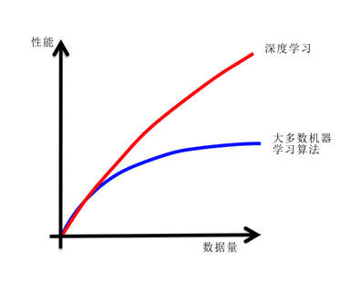
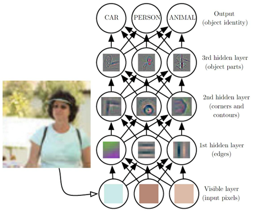
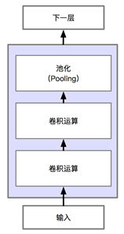

# 4. 深度学习和无人驾驶视觉感知

近期在学术领域存在许多批判深度学习的言论，深度学习在一些学者看来并不是通往通用人工智能的道路。但是，作为关注行业应用的研究者和工程师，我们只需要知道深度学习到底能不能够解决我们领域的一些问题（通过传统的软件工程很难解决的问题）。就无人驾驶领域来说，答案是肯定的。依托机器学习和深度学习在模式识别领域取得的成功，基于深度学习的无人驾驶感知方法在近年来取得了一系列的进展。本章将以尽可能直白的方式，从深度前馈神经网络切入，结合理论和实践介绍深度学习在无人驾驶中的应用。

## 4.1 深度前馈神经网络

大数据是深度神经网络在性能上取得成功的一个重要因素，传统机器学习算法在数据量增大到一定的数量级以后一般会陷入一个性能的瓶颈（尤其是基于结构风险最小化的支持向量机，其性能会在数据量到达一定程度以后饱和），但是神经网路似乎是可以不断扩容的机器学习算法，数据量增大时，可以通过增加神经元的个数以及隐含层的层数来训练更加强大的神经网络，其变化趋势大致如下：

我们之前的文章也提到，仅仅是简单的三层神经网络，通过增加隐含层神经元数量，理论上也可以拟合任意函数。那么我们为什么不直接使用单纯的三层网络结构拟合复杂问题呢？

单纯的增加单隐含层神经元数量可以增强模型的表示能力，但是相比于增加层数，每层使用相对少的神经元的策略，前者在实际训练中训练成功的难度更大，包含大量隐含层神经元的三层网络的过拟合问题难以控制，并且要达到相同的性能，深层神经网络往往要比三层网络需要的神经元更少。

### 4.1.1 表示学习

另一种对深度学习前若干层作用的解释就是表示学习。**深度学习=深度表示学习（特征学习）**，下图是一个多层卷积网络在输入图像以后，隐含层神经元激活的可视化结果：

如图所示，神经网络的前若干层实际上发挥了特征提取和表示建立的作用，这区别于传统机器学习方法的人为设计特征，神经网络的特征设计是伴随着神经网络的训练而进行的，是一个自动表示建立的过程。从图中我们还能发现，越靠近输入端的层（越底层）提取的特征越简单，层数越高建立的特征越复杂。例如，第一层提取了“边缘”特征，第二层则提取了轮廓特征，第三层则通过组合简单的底层特征，综合出了更加高级的表示，提取的是识别目标的局部特征。通过对特征的逐层抽象化，神经网络的层数越多，其能够建立的特征表示也就越丰富。

## 4.2 应用于深度神经网络的正则化技术

当神经网络的隐含层数和神经元数量增大时，随之而来的是参数数量的大幅度增大，我们称之为神经网络的**模型容量（Model Capacity）**过大。神经网络尤其是深层神经网络的模型容量几乎总是过大的，过大的模型容量有利也有弊。一方面，更大的模型容量意味着更强的表示能力，我们可以使用神经网络学习更加复杂的映射关系；另一方面，过大的模型容量会使得模型的训练“不可控”，即训练的模型会更倾向于过拟合，即模型在训练集上表现好，但是泛化能力差。在机器学习中，我们可以设计一些策略来减少测试误差和训练误差的差距（或者说提高模型的泛化能力，增强模型的鲁棒性等等），这些策略被统称为**正则化（Regularization）**方法。下面我们介绍四种常见的正则化技术，它们分别是：

- **数据集增强（Data Agumentation）**

- **提前终止（Early Stopping）**

- **参数范数惩罚（Parameter Norm Penalties）**

- **丢弃技术（Dropout）**

## 4.3 卷积神经网络入门

### 4.3.1 什么是卷积以及卷积的动机

**卷积（Convolution）**是一种特殊的线性运算，是对两个实值函数的一种数学运算。**卷积神经网络是指在网络中至少使用了一层卷积运算来代替一般的矩阵乘法运算的神经网络。**在我们之前的前馈神经网络的例子中，我们使用全连接层作为网络的组成结构，全连接层中的输入实际上是上层的输入乘以权重的累加，本质上是一个矩阵乘法，卷积层实际上就是用卷积运算替代了全连接层中的矩阵乘法，卷积的出发点是通过下述三种思想来改进机器学习系统：

- **稀疏交互(sparse interactions)**

- **参数共享(parameter sharing)**

- **等变表示(equivariant representations)**

由于以上三个特性，卷积这种运算实际上改进了全连接神经网络中单纯的矩阵运算。和全连接网络层一样，一个卷积神经网络层通常也包括激活函数，同时还发展出了一种新的传递结构——池化（Pooling）。下图是一个典型的卷积神经网络层（我们简称卷积层），传统的卷积层包含如下三个结构：

- **卷积运算**：在图像处理问题中，我们通常使用的是2维的卷积运算，卷积层中的激活函数起着与全连接网络一样的非线性网络的作用，ReLU 是最常用的激活函数。

- **激活函数（非线性变换）**

- **池化（Pooling）**：池化通常也被称为池化函数，池化函数的定义就是：一种使用相邻位置的总体统计特征来替换该位置的值，池化的理念有点像时序问题中的滑动窗口平均。常用的池化函数主要有**最大池化（Max Pooling）**和**平均池化（Average Pooling）**，分别是输出相邻的矩阵区域的最大值和平均值。不论是哪种池化，都对输入图像中的目标的少量平移具有不变性，因从网络能够进一步学习到应该对哪些变换具有不变性。

### 4.3.2 卷积的一些细节

- **填充（Padding）**

- **输入输出尺寸**

- **卷积核的深度**