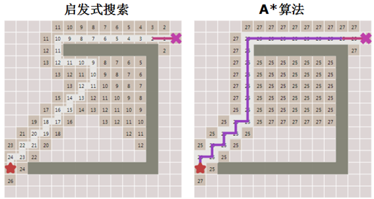
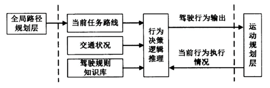
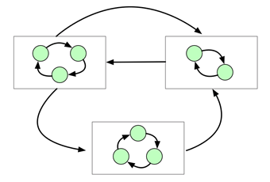

# 5. 无人驾驶规划入门

本章将重点介绍无人驾驶系统中的规划层。如第一章所述，无人驾驶系统规划层模块包括三层结构：任务规划、行为规划和动作规划。

在介绍规划系统之前，先重点介绍一下A\*算法，因为A\*算法在任务规划的应用中非常广泛，作为离散空间搜索算法，A*算法多用于离散空间最优路径搜索问题的解决。。

行为规划是无人车系统决策的核心部分，通常使用有限状态机（FSM）来设计一个行为决策模型，除FSM以外，本章还将介绍在DARPA无人车挑战赛中应用并取得成功的分层有限状态机的相关内容。

## 5.1 A\*算法

A\*算法在自动驾驶算法领域的多个层面都有应用，它是一个经典高效的离散空间路径搜索算法。在任务规划中，A\*算法可用来在城市路网中找到一条最短路线；在动作规划当中，定制的A*也可用于局部最优路径的搜索。

A\*算法要解决的问题是：基于一张图，找到从起点（start）到终点（goal）之间的最短路径（Path），同时避开障碍物，并使算法尽可能高效。本节将通过演绎迭代的方式，逐步揭示出A\*算法的核心思路。首先，我们需要用一种数据结构将问题的核心——“图”表示出来。在自动驾驶的任务规划中，通常会针对一个道路路网文件(The Route Network Definition File，RNDF)进行路径规划，这个路网的数据是一张有向图。

一方面，我们期望算法有方向地进行扩展（启发式），另一方面又需要得到尽可能最短的路径，将这两方面考量指标结合起来，A\*就诞生了。A\*结合了Dijkstra和启发式算法的优点，以从起点到该点的距离加上该点到终点的估计距离之和作为该点在PriorityQueue中的优先级。下图展示了A\*算法的运行效果，由图可见，A\*算法成功克服了启发式搜索遇到的问题。

A\*算法主要维护两个List：Open List和Close List。Open List指的是frontier，表示接下来有可能要遍历的一系列节点。Close List包含所有已经遍历过了的节点。

## 5.2 分层有限状态机和无人车行为规划

行为规划又称为行为决策，是无人车规划模块三层体系（任务、行为、动作）的中间层，本节将主要介绍行为规划的基本概念和核心设计思路，同时对无人车行为规划方法：分层有限状态机进行介绍。

行为规划层处于无人车规划模块的中间，位于上层的任务规划层和底层的动作规划层之间，驾驶行为规划也被称为驾驶行为决策，这一层的作用主要是基于来自上层（任务规划层）的全局最优行驶路线轨迹，根据对当前的交通和环境感知信息的理解，来确定自身当前驾驶状态，在交通规则的约束和驾驶经验的指导下规划出合理的驾驶行为。下图是无人车行为决策层的信息流：

### 5.2.1 无人车决策规划系统设计准则

行为规划的内容直接关系到无人车驾驶的可靠性和安全性，要设计出完全符合人类驾驶员驾驶习惯和交通规则的行为规划系统在目前来看仍然是一大挑战，实现行为规划的方法有很多，但其设计理念大致可以总结为两点：

- 合理性：无人车驾驶的合理性建立在两个基础之上：交通法规和驾驶经验。其中交通法规的优先级又要高于驾驶经验，交通法规需要考虑的内容包括：靠右侧车道行驶，不能超速，换道超车时应提前开启转向灯，对于感知到的交通信号灯和交通标志，应按照其指示内容行驶，出现任何危险情况，应当能够果断地执行紧急制动等等。驾驶经验需要考虑的内容主要包括：尽量保持在原车道，不应随心所欲的变道；城市路段行驶时，不应随意加速，确保驾驶的舒适性；对于前车行驶缓慢而条件允许的情况下可以果断超车等等。因此，在行为规划的系统设计上，必须酌情考虑这两方面的因素。

- 实时性：任何无人驾驶系统中的行为规划都是实时的，行为规划应当能够处理复杂的动态交通场景，并且能够根据环境的变化，快速地调整驾驶行为以避免危险发生。

### 5.2.2 有限状态机

目前在无人车行为规划层的实现上并没有一个“最佳解决方案”，当前普遍认可和采用的方法是采用分层有限状态机（Hierarchical Finite-State Machine ，HFSM），分层有限状态机也是早期DARPA挑战赛中被许多队伍采用的行为规划方法，而有限状态机是分层有限状态机的基础。

有限状态机就是一个非常简单的抽象反应系统，它之所以简单是因为它只针对特定的外界输入产生数量有限的响应，在有限状态机中，我们只能构造出有限数量的状态，外界的输入只能让状态机在有限的状态集合中从一个状态转移到另一个状态。

### 5.2.3 分层有限状态机

当存在大量状态时，有限状态机体系就有可能变得非常庞大，状态机的结构也会变得更加复杂，此外，有限状态机还存在如下几个问题：

- 可维护性差：当新增或者删除一个状态的时候，需要改变所有与之相关联的状态，所以对状态机的大幅度的修改很容易出问题；

- 可扩展性差：当FSM包含大量状态时，有向图可读性很差，扩展性较差；

- 复用性差：几乎不可能在多个项目中使用相同的FSM

这时候就需要使用分层状态机(Hierarchical Finite-State Machine)了，把那些同一类型的状态机作为一个状态机，然后再做一个大的状态机，来维护这些子状态机，如下图所示：

相比于FSM，HFSM增加了一个超级状态（Super-state）：本质上就是将同一类型的一组状态组合为一个集合（即上图中的方框），超级状态之间也有转移逻辑。这也就意味着HFSM不需要为每一个状态和其他状态建立转移逻辑，由于状态被归类，类和类之间存在转移逻辑，那么类和类之间的状态转移可以通过继承这个转移逻辑来实现，这里的转移继承就像面向对象编程中通过多态性让子类继承父类一样。

