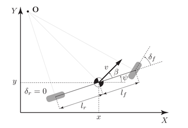
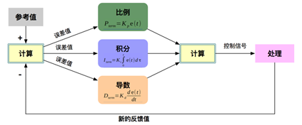

# 6. 车辆模型和高级控制

控制模块作为无人车的实际动作执行模块，其设计目标在于让车辆尽可能地照规划层规划好的动作序列运动。本章将介绍无人驾驶汽车系统开发中需要的控制相关的理论和技术。包括基本的车辆运动模型，PID控制，模型预测控制等。

## 6.1 运动学自行车模型和动力学自行车模型

在了解高级的车辆控制算法之前，掌握车辆运动模型是非常有必要的。车辆运动模型就是一类能够描述车辆的运动规律的模型。显然，越复杂的模型就越接近现实中的车辆运动规律，本节介绍两个广泛使用的车辆模型——**运动学自行车模型（Kinematic Bicycle Model）**和**动力学自行车模型（Dynamic Bicycle Model）。**

无人驾驶系统分成感知、规划和控制三层，规划层往往会基于更加高层的（感知层，定位层）的信息和底层的（控制层）的实时信息指定行驶的路径，那么从规划层输出的就是车辆的参考动作序列，控制系统需要做的就是严格按照这个参考动作序列去驾驶车辆，一般来说，可以使用多项式的形式来描述这个路径曲线。

无人车的控制依赖于一项称为**模型预测控制(Model Predictive Control)**的技术，这种控制的方法是产生一系列的可行的（也就是说在实际上车辆能够做到的）控制输入，基于一定的算法（往往是带约束的非线性优化算法）来调整这一系列的控制输入，使得一个**损失函数(Cost Function)**最小化，这个损失函数的求解依赖于车辆的运动学或者动力学模型的输出和参考的路径的差值，这些模型正是本节介绍的内容。

### 6.1.1 自行车模型（Bicycle Model）

建立模型往往是为了简化问题，要简化汽车运动描述的问题，自行车模型（Bicycle Model）是一种简单且有效的简化方式。自行车模型基于如下几个假设：

- 忽略车辆在垂直方向的运动，即假定车辆是一个二维平面上的运动物体（可以等价于在天空中的俯视视角）

- 假设车辆的结构就像自行车一样，即车辆的前面两个轮胎拥有一致的角度和转速等，同样后面的两个轮胎也是如此，那么前后的轮胎就可以各用一个轮胎来描述

- 假设车辆运动也和自行车一样，就意味着是前面的轮胎控制车辆的转角

运动学自行车模型的控制量可以简化为（a, f），其中 a 是车辆的加速度，踩油门踏板意味着正的加速度，踩刹车踏板意味着负的加速度。  f 是方向盘的转角，假定这个方向盘转角就是前轮当前的转角。这样，我们使用两个量描述了车辆的**控制输入(Control Input)**。然后我们定义模型中的状态量，运动学自行车模型使用四个状态量来描述车辆的当前状态：

- x: 即车辆当前的 x 坐标

- y: 即车辆当前的 y 坐标

- q: 即车辆当前的偏航角（Yaw，用弧度来描述，逆时针方向为正）

- v: 即车辆的速度

一个简单的运动学自行车模型如图所示：

基于这个简单的运动学自行车模型，在给定了一个时刻的控制输入以后，可以计算求得dt时间以后车辆的状态信息（坐标，偏航角以及速度），这个模型就可以作为模型预测控制中的车辆模型了。

前面的车辆运动学自行车模型其实还隐含着一个重要的假设，即：**车前轮的方向是车辆当前的速度方向**，在实际车辆运动过程中，当车辆在以相对高的速度行驶时，**车轮的方向并不一定为车辆当前的速度方向**，这个时候，需要引入车辆的动力学自行车模型。

车辆动力学模型通过对轮胎和路面之间的复杂相互作用来描述车辆的运动。在一个动力模型中，我们需要考虑各种各样的力的作用，它们可以大致分为两类：**纵向力(Longitudinal Force)**和**侧向力（Lateral Force）**, 纵向力就是使车辆前后移动的力量，而侧向力则促使车辆在横向移动，在力的相互作用过程中，轮胎起着决定性的作用（根据物理规律，轮胎是车辆运动的一个重要的力的来源）。

## 6.2 无人车控制入门

### 6.2.1 为什么需要控制理论

试想有如下场景，当你驾驶一辆汽车通过这个弯道的时候，你会如何操作车辆过弯呢？

如果不是专业的赛车选手的话，无法做到一步到位的控制，通常需要一边观察车辆相对于路线的偏差，一边调整方向盘的角度和油门踏板的力度，这种基于环境反馈的控制方法被为**反馈控制**。

控制模块的目的是让无人车能够按照规划好的路径行驶，需要将环境当前的反馈和规划的参考量进行比较，得到当前偏离参考量的误差，基于这个误差，设计一定的算法来产生输出信号，使得这个误差不断变小。那么如何基于这个误差来产生控制指令呢？最直接的方法就是要让误差在控制下逐渐变小直到为0。

零误差就意味着车一直在参考轨迹上行驶，如何减少误差就是下面要向大家介绍的内容。为了理解反馈控制，先学习**PID控制**，PID控制是目前利用最为广泛的控制理论，接下来以它为出发点讨论控制理论。

PID就是指**比例（proportion）**、**积分（integral）**、**导数（derivative）**，这三项表示如何使用误差产生控制指令，整个流程如下：

## 6.3 基于运动学模型的模型预测控制

前面介绍了两种常见的车辆模型——运动学自行车模型和动力学自行车模型，本节基于运动学车辆模型引入一种新的控制理论——**模型预测控制** **(Model Predictive Control)**，传统的PID控制器简单易于实现，被广泛应用，但由于PID控制器的延迟性，在实际无人车的横向控制（转向控制）中，并不常使用。横向控制中，通常使用**优化控制**方法，MPC是一类追求短时间间隔内最优化控制的理论，它可以将控制延迟考虑到车辆模型中去，从而避免PID控制器的延迟问题。

### 6.3.1 将PID控制应用于转向控制的问题

PID作为一种反馈控制方法，因其简单易实现被大量应用。但是在实际的车辆控制中，车辆往往不能立刻执行控制指令，这其中存在一定的延迟，也就是说，控制指令会在“未来的车辆状态下”被执行，但是，由于PID是一种反馈控制，控制指令由当前车辆所处的状态决定的，然而当制动的指令被执行的时候，由于存在一定的延迟，车辆已经处于“未来的状态”了，在这个“未来的状态下”使用该指令去制动就会有一定的危险性。这是在无人车转向控制中使用PID算法的最大问题。

模型预测控制（MPC）是一种将更长时间跨度、甚至于无穷时间的最优化控制问题，分解为若干个更短时间跨度，或者有限时间跨度的最优化控制问题，并且在一定程度上仍然追求最优解的理论。模型预测控制由如下三个要素组成：

- 预测模型：预测模型能够在短时间内很好地预测系统状态的变化
- 在线滚动优化：通过某种最优化算法来优化未来一段时间的控制输入，使得在这种控制输入下预测模型的输出与参考值的差距最小
- 反馈校正：到下一个时间点根据新的状态重新进行预测和优化

## 6.4 轨迹追踪

对于无人车来说，规划好的路径通常由一系列路径点构成，这些路径点通常包含空间位置信息，姿态信息，速度和加速度等，这些路径点被称为全局路径点（Global Waypoint）。路径（Path）和轨迹（Trajectory）的区别就在于，轨迹还包含了时间信息，轨迹点也是一种路径点，它在路径点的基础上加入了时间约束，通常将这些轨迹点称为局部路径点（Local Waypoints）。下图表示的是在地图中的序列全局路径点：

如何让无人车追踪这个轨迹？目前的主流方法分为两类：基于几何追踪的方法和基于模型预测的方法，在本节介绍一种简单且广泛使用的基于几何追踪的方法——纯追踪法（Pure Pursuit）。

以纯追踪控制器为代表的几何路径跟踪器很容易理解和实现。本节介绍的几何方法实现了基本的路径跟踪，但是当存在显著的速度改变时会遇到瓶颈，纯追踪方法使用前视距离考虑路径信息，这种方法在低速情况下几乎不受路径形状的影响。但是，选择最佳的前视距离的方法并不明确。将前视距离表示为速度的函数是一种常见的方法，然而，前视距离也可能是路径曲率的函数，甚至可能和纵向速度以外的CTE有关。所以纯追踪控制器的前视距离调整应该额外注意，很短的前视距离会造成车辆控制的不稳定甚至震荡，为了确保车辆稳定而设置较长的前视距离又会出现车辆在大转角处转向不足的问题。